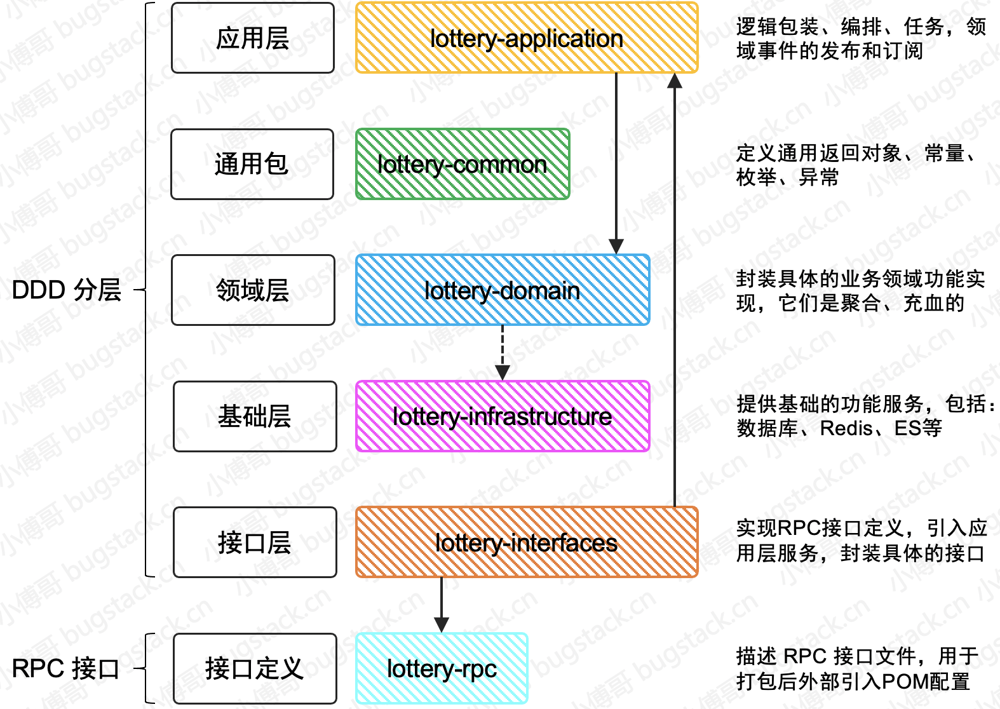
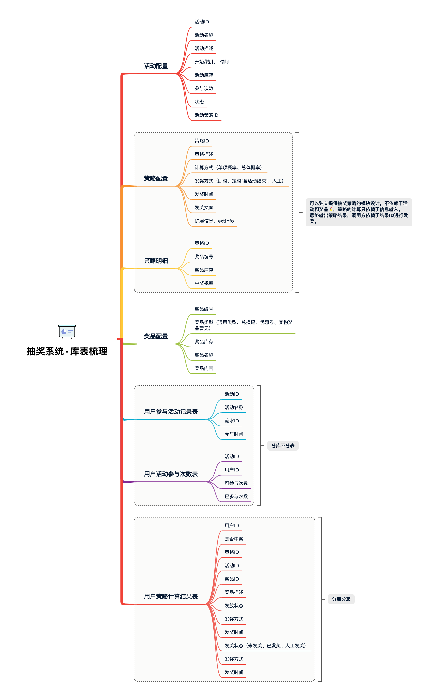

# Lottery

- 技术：SpringBoot、Mybatis、Dubbo、MQ、Redis、Mysql、ELK、分库分表、Otter
- 架构：DDD 领域驱动设计、充血模型、设计模式

微服务抽奖系统

DDD 分层架构

DDD (Domain-Driven Design) 是一种软件开发方法，它的核心是将系统按照业务领域进行划分，并将业务逻辑与技术实现相分离。DDD 的分层架构是其重要的组成部分，它主要包括以下四层：

表现层（Presentation Layer）：负责展示数据和接收用户的请求，以及将请求传递给应用服务层。在 Web 应用中通常是控制器层。

应用服务层（Application Service Layer）：负责处理业务逻辑，协调领域对象、基础设施服务和外部系统，以及将数据传递给领域层进行处理。在应用中通常是服务层。

领域层（Domain Layer）：是 DDD 的核心，负责定义业务领域中的概念、规则和行为。它包含实体、值对象、聚合根、领域服务等概念，以及业务逻辑的实现。

基础设施层（Infrastructure Layer）：负责提供技术实现和基础设施服务，如数据库、缓存、消息队列等。它是整个系统的基础，领域层和应用层可以使用它来实现业务逻辑。

其中，应用服务层通过领域服务来调用领域层中的业务逻辑，领域层通过基础设施服务来访问外部资源，如数据库、消息队列等。

DDD 分层架构的优点是能够将系统按照业务领域进行划分，使得系统更加清晰、易于维护和扩展。同时，它还能够将业务逻辑与技术实现相分离，使得系统更加松耦合、灵活性更高。

lottery-application，应用层，引用：domain

lottery-common，通用包，引用：无

lottery-domain，领域层，引用：infrastructure

lottery-infrastructure，基础层，引用：无

lottery-interfaces，接口层，引用：application、rpc

lottery-rpc，RPC接口定义层，引用：common

在抽奖活动的设计和开发过程中，会涉及到的表信息包括：活动表、奖品表、策略表、规则表、用户参与表、中奖信息表等

Dubbo 中广播模式的配置，在你实际使用的过程中一般都是使用注册中心模式

#### 4、抽奖活动策略库表设计
为什么需要分库分表？

- 解决连接数瓶颈，解决数据增量，通常数据存量200w-300w，增量在单表50w就要考虑拆表了。
- 分库分表之后，数据分散，通过路由规则和负载均衡策略保证请求均衡打在不同库表上，不用担心会集中打在某个库表上造成数据库瘫痪。
- 本质上：减少数据库压力，提高数据库效率，缩短查询时间

为什么分库？
- 解决qps过高，连接数不够用
- 操作非常高频，如果业务量剧增，数据库可能会出现性能瓶颈，这时可能需要考虑分库，如以下几方面考虑：
    - 磁盘存储：业务量剧增，mysql 单机磁盘容量会撑爆，分库，减少磁盘使用率。
    - 并发连接支撑：数据库的连接是有限的，大量请求访问数据库，MySQL单机无法承受，分库分摊连接请求。（同时可以采用缓存架构来降低访问）

为什么分表？
-  解决数据量过大，查询效率不高

分库分表带来的问题：
- 事务
- 跨库关联
- 排序
- 分页
- 分布式ID

一个满足业务需求的抽奖系统，需要提供抽奖活动配置、奖品概率配置、奖品梳理配置等内容，同时用户在抽奖后需要记录用户的抽奖数据，这就是一个抽奖活动系统的基本诉求。

- 活动配置，activity：提供活动的基本配置
- 策略配置，strategy：用于配置抽奖策略，概率、玩法、库存、奖品
- 策略明细，strategy_detail：抽奖策略的具体明细配置
- 奖品配置，award：用于配置具体可以得到的奖品
- 用户参与活动记录表，user_take_activity：每个用户参与活动都会记录下他的参与信息，时间、次数
- 用户活动参与次数表，user_take_activity_count：用于记录当前参与了多少次
- 用户策略计算结果表，user_strategy_export_001~004：最终策略结果的一个记录，也就是奖品中奖信息的内容

1. 这些库表是用于支撑起抽奖系统开发的必备表，后续可能会随着功能的开发做适当的调整。
2. 接下来我们会围绕这些库表一点点实现各个领域的功能，包括：抽奖策略领域、奖品发放领域、活动信息领域等

#### 抽奖策略领域模块开发

需求引出设计

需求：在一场营销抽奖活动玩法中，运营人员通常会配置以转盘、盲盒等展现形式的抽奖玩法。例如在转盘中配置12个奖品，每个奖品配置不同的中奖概率，当1个奖品被抽空了以后，那么再抽奖时，是剩余的奖品总概率均匀分配在11个奖品上，还是保持剩余11个奖品的中奖概率，如果抽到为空的奖品则表示未中奖。其实这两种方式在实际的运营过程中都会有所选取，主要是为了配合不同的玩法。

设计：那么我们在做这样的抽奖领域模块设计时，就要考虑到库表中要有对应的字段来区分当前运营选择的是什么样的抽奖策略。那么在开发实现上也会用到对应的策略模式的使用，两种抽奖算法可以算是不同的抽奖策略，最终提供统一的接口包装满足不同的抽奖功能调用。

- 在库表设计上我们把抽奖需要的策略配置和策略明细，它们的关系是1vn。
- 另外为了让抽奖策略成为可以独立配置和使用的领域模块，在策略表用不引入活动ID信息的配置。因为在建设领域模块的时候，我们需要把让这部分的领域实现具有可独立运行的特性，不让它被业务逻辑污染，它只是一种无业务逻辑的通用共性的功能领域模块，在业务组合的过程中可以使用此功能领域提供的标准接口。
- 通过这样的设计实现，就可以满足于不同业务场景的灵活调用，例如：有些业务场景是需要你直接来进行抽奖反馈中奖信息发送给用户，但还有一些因为用户下单支付才满足抽奖条件的场景对应的奖品是需要延时到账的，避免用户在下单后又进行退单，这样造成了刷单的风险。所以有时候你的设计是与业务场景息息相关的

在领域功能开发的服务下主要含有 model、repository、service 三块区域：
- model，用于提供vo、req、res 和 aggregates 聚合对象。
- repository，提供仓储服务，其实也就是对Mysql、Redis等数据的统一包装。
- service，是具体的业务领域逻辑实现层，在这个包下定义了algorithm抽奖算法实现和具体的抽奖策略包装 draw 层，对外提供抽奖接口 IDrawExec#doDrawExec

抽奖算法实现

暂时针对两种抽奖算法做出描述：场景A20%、场景B30%，场景C50%
- 总体概率：如果A奖品抽空后，B和C奖品的概率按照 3:5 均分，相当于B奖品中奖概率由 0.3 升为 0.375
    - 分别把A、B、C对应的概率值转换成阶梯范围值，A=(0~0.2」、B=(0.2-0.5」、C=(0.5-1.0」，当使用随机数方法生成一个随机数后，与阶梯范围值进行循环比对找到对应的区域，匹配到中奖结果。
    - 使用随机数工具生产一个100内的随值与奖品列表中的值进行循环比对，算法时间复杂度O(n)

- 单体概率：如果A奖品抽空后，B和C保持目前中奖概率，用户抽奖扔有20%中为A，因A库存抽空则结果展示为未中奖。为了运营成本，通常这种情况的使用的比较多
    - 单项概率算法不涉及奖品概率重新计算的问题，那么也就是说我们分配好的概率结果是可以固定下来的。好，这里就有一个可以优化的算法，不需要在轮训匹配O(n)时间复杂度来处理中奖信息，而是可以根据概率值存放到HashMap或者自定义散列数组进行存放结果，这样就可以根据概率值直接定义中奖结果，时间复杂度由O(n)降低到O(1)。这样的设计在一般电商大促并发较高的情况下，达到优化接口响应时间的目的。

#### 简单工厂搭建发奖领域
截止到目前我们开发实现的都是关于 domain 领域层的建设，当各项核心的领域服务开发完成以后，则会在 application 层做服务编排流程处理的开发。例如：从用户参与抽奖活动、过滤规则、执行抽奖、存放结果、发送奖品等内容的链路处理。涉及的领域如下：

- 关于 award 发奖领域中主要的核心实现在于 service 中的两块功能逻辑实现，分别是：goods 商品处理、factory 工厂🏭

- goods：包装适配各类奖品的发放逻辑，虽然我们目前的抽奖系统仅是给用户返回一个中奖描述，但在实际的业务场景中，是真实的调用优惠券、兑换码、物流发货等操作，而这些内容经过封装后就可以在自己的商品类下实现了。
- factory：工厂模式通过调用方提供发奖类型，返回对应的发奖服务。通过这样由具体的子类决定返回结果，并做相应的业务处理。从而不至于让领域层包装太多的频繁变化的业务属性，因为如果你的核心功能域是在做业务逻辑封装，就会就会变得非常庞大且混乱。

利用工厂模式+接口封装奖品，让每一块功能都更加清晰易于扩展和维护。

#### 活动领域的配置与状态

#### ID生成策略

关于 ID 的生成因为有三种不同 ID 用于在不同的场景下；

- 订单号：唯一、大量、订单创建时使用、分库分表
- 活动号：唯一、少量、活动创建时使用、单库单表
- 策略号：唯一、少量、活动创建时使用、单库单表

#### 数据库路由组件
基于 HashMap 核心设计原理，使用哈希散列+扰动函数的方式，把数据散列到多个库表中的组件

难点：散列算法、数据源动态切换 AbstractRoutingDataSource、ThreadLocal

首先需要知道为什么要分库分表？其实就是由于业务体量较大，数据增长较快，所以需要把用户数据拆分到不同的库表中去，减轻数据库压力。

分库分表操作主要有垂直拆分和水平拆分：
- 垂直拆分：指的是按照业务将表进行分类，分布到不同的数据库上，这样也就将数据的压力分摊到不同的库上。最终一个数据库由很多表的构成，每个表对应着不同的业务，即专库专用
- 水平拆分：如果垂直拆分后遇到单机瓶颈，可以使用水平拆分。相对与垂直拆分的区别：垂直拆分是把不同的表拆到不同的数据库中。而水平拆分，是把同一个表拆到不同的数据库中。如：user_001、user_002

### 附录

抽奖系统工程采用DDD架构 + Module模块方式搭建，lottery-domain 是专门用于开发领域服务的模块【包括但不限于 抽奖策略，还有活动领域、规则引擎、用户服务等】

