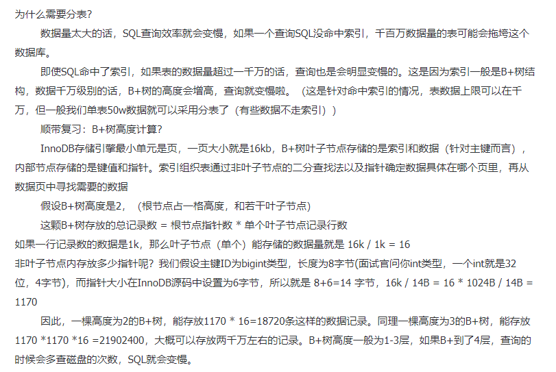

# Lottery
微服务抽奖系统

DDD 分层架构

DDD (Domain-Driven Design) 是一种软件开发方法，它的核心是将系统按照业务领域进行划分，并将业务逻辑与技术实现相分离。DDD 的分层架构是其重要的组成部分，它主要包括以下四层：

表现层（Presentation Layer）：负责展示数据和接收用户的请求，以及将请求传递给应用服务层。在 Web 应用中通常是控制器层。

应用服务层（Application Service Layer）：负责处理业务逻辑，协调领域对象、基础设施服务和外部系统，以及将数据传递给领域层进行处理。在应用中通常是服务层。

领域层（Domain Layer）：是 DDD 的核心，负责定义业务领域中的概念、规则和行为。它包含实体、值对象、聚合根、领域服务等概念，以及业务逻辑的实现。

基础设施层（Infrastructure Layer）：负责提供技术实现和基础设施服务，如数据库、缓存、消息队列等。它是整个系统的基础，领域层和应用层可以使用它来实现业务逻辑。

其中，应用服务层通过领域服务来调用领域层中的业务逻辑，领域层通过基础设施服务来访问外部资源，如数据库、消息队列等。

DDD 分层架构的优点是能够将系统按照业务领域进行划分，使得系统更加清晰、易于维护和扩展。同时，它还能够将业务逻辑与技术实现相分离，使得系统更加松耦合、灵活性更高。

lottery-application，应用层，引用：domain

lottery-common，通用包，引用：无

lottery-domain，领域层，引用：infrastructure

lottery-infrastructure，基础层，引用：无

lottery-interfaces，接口层，引用：application、rpc

lottery-rpc，RPC接口定义层，引用：common

在抽奖活动的设计和开发过程中，会涉及到的表信息包括：活动表、奖品表、策略表、规则表、用户参与表、中奖信息表等

Dubbo 中广播模式的配置，在你实际使用的过程中一般都是使用注册中心模式

#### 4、抽奖活动策略库表设计
为什么需要分库分表？

- 解决连接数瓶颈，解决数据增量，通常数据存量200w-300w，增量在单表50w就要考虑拆表了。
- 分库分表之后，数据分散，通过路由规则和负载均衡策略保证请求均衡打在不同库表上，不用担心会集中打在某个库表上造成数据库瘫痪。
- 本质上：减少数据库压力，提高数据库效率，缩短查询时间

为什么分库？
- 解决qps过高，连接数不够用
- 操作非常高频，如果业务量剧增，数据库可能会出现性能瓶颈，这时可能需要考虑分库，如以下几方面考虑：
    - 磁盘存储：业务量剧增，mysql 单机磁盘容量会撑爆，分库，减少磁盘使用率。
    - 并发连接支撑：数据库的连接是有限的，大量请求访问数据库，MySQL单机无法承受，分库分摊连接请求。（同时可以采用缓存架构来降低访问）

为什么分表？
-  解决数据量过大，查询效率不高

分库分表带来的问题：
- 事务
- 跨库关联
- 排序
- 分页
- 分布式ID

一个满足业务需求的抽奖系统，需要提供抽奖活动配置、奖品概率配置、奖品梳理配置等内容，同时用户在抽奖后需要记录用户的抽奖数据，这就是一个抽奖活动系统的基本诉求。

- 活动配置，activity：提供活动的基本配置
- 策略配置，strategy：用于配置抽奖策略，概率、玩法、库存、奖品
- 策略明细，strategy_detail：抽奖策略的具体明细配置
- 奖品配置，award：用于配置具体可以得到的奖品
- 用户参与活动记录表，user_take_activity：每个用户参与活动都会记录下他的参与信息，时间、次数
- 用户活动参与次数表，user_take_activity_count：用于记录当前参与了多少次
- 用户策略计算结果表，user_strategy_export_001~004：最终策略结果的一个记录，也就是奖品中奖信息的内容

1. 这些库表是用于支撑起抽奖系统开发的必备表，后续可能会随着功能的开发做适当的调整。
2. 接下来我们会围绕这些库表一点点实现各个领域的功能，包括：抽奖策略领域、奖品发放领域、活动信息领域等

